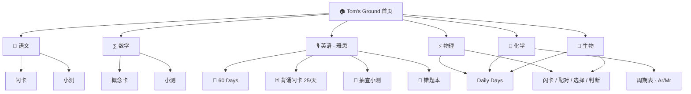
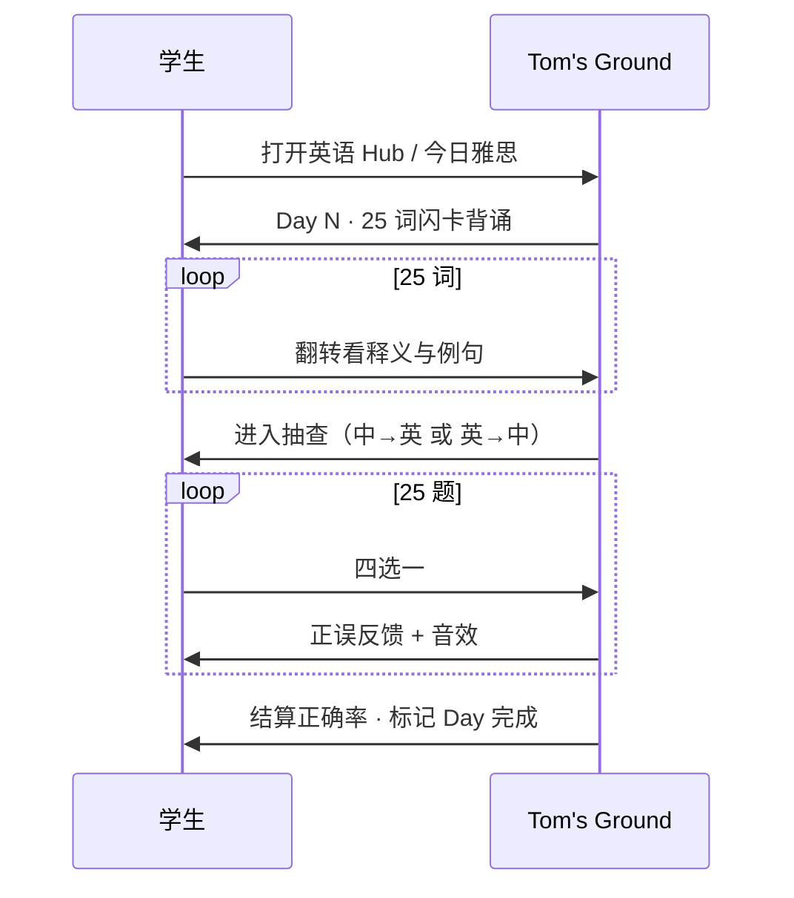

# Tom's Ground

<p align="center">
  
</p>

<p align="center">
  <strong>上海诺达 NACIS · 八年级全科拔尖练习站</strong><br/>
  语 · 数 · 英(雅思) · 物 · 化 · 生<br/>
  中英双语 · Wayground 风格刷题 · 本地一键运行
</p>

<p align="center">
  <a href="#快速开始">快速开始</a> ·
  <a href="#产品结构">产品结构</a> ·
  <a href="#雅思词汇计划">雅思 60 天</a> ·
  <a href="#学科内容">学科内容</a> ·
  <a href="#技术架构">技术架构</a>
</p>

---

## 这是什么？

**Tom's Ground** 是为 **上海诺达双语学校（NACIS）八年级** 学生打造的本地网页练习站。  
首页按学科进入，每个学科有独立练习模式；英语模块对标 **雅思 7.0** 词汇量，采用「每天 25 词背诵 → 抽查」的节奏。

| 亮点 | 说明 |
|------|------|
| 六大学科门户 | 语文 / 数学 / 英语·雅思 / 物理 / 化学 / 生物 |
| 雅思 Band 7 | **1500** 词 · **60 天** · 每天 **25** 词 |
| 中英切换 | 右上角 **中 / 双语 / EN** |
| Wayground 风 UI | 紫底、四色 ABCD、连击 HUD、音效反馈 |
| 本地优先 | `localStorage` 记进度与错题，无需后端 |

---

## 快速开始

```bash
git clone https://github.com/Tomhao10225101490/NACIS-Tomhub.git
cd NACIS-Tomhub
git pull
npm install
npm run dev
```

浏览器打开：**http://localhost:5173/**

> 国内若 `npm install` 较慢：
> ```bash
> npm config set registry https://registry.npmmirror.com
> ```

生产构建：

```bash
npm run build
npm run preview
```

### 在线访问（GitHub Pages）

学生可直接打开：

**https://tomhao10225101490.github.io/NACIS-Tomhub/**

- 纯静态托管（HTML / CSS / JS），电脑关机也照样在线
- 推送到 `main` 后，GitHub Actions 会自动 `npm run build` 并部署
- 进度存在学生浏览器的 `localStorage`，无需后端

首次启用：仓库 **Settings → Pages → Build and deployment → Source** 选 **GitHub Actions**（若尚未选中）。

---

## 产品结构



### 首页体验

1. 顶部品牌 **Tom's Ground** + 语言 / 音效开关  
2. **今日雅思** 焦点卡：直接进入当天 25 词一条龙  
3. **六大学科卡片**：点击进入该学科 Hub，再选具体练习  

---

## 雅思词汇计划（冲 7.0）

> 目标：覆盖雅思学术向 **Band 6.5–7.5** 高频词，按天推进，背完再抽查。

| 项目 | 数量 |
|------|------|
| 总词汇 | **1500**（去重） |
| 计划天数 | **60 Days** |
| 每日新词 | **25** |
| 流程 | 背诵闪卡 → 释义选词抽查 |
| 词性 / 音标 / 中英释义 / 例句 | 全收录 |

### 每日流程



### 主题轮换（示例）

Academic · Education · Environment · Technology · Health · Society · Economy · Culture · Science · Work · Media · Urban · Crime · Travel · Psychology · Law · Energy · Politics · Food · Sport

### 复习建议（可自行配合）

| 节奏 | 建议 |
|------|------|
| 当日 | 背 25 + 抽查 ≥80% |
| 次日 | 重做错题本里的雅思词 |
| 周末 | 回顾本周 5 Days（约 125 词） |
| 60 天后 | 约 **1500** 词，衔接雅思阅读/写作表达 |

---

## 学科内容

| 学科 | 主要内容 | 规模（约） |
|------|----------|------------|
| **英语 · 雅思** | Band 7 词汇背诵 + 抽查 | 1500 词 / 60 Days |
| **语文** | 成语、修辞、文言、阅读术语 | 120+ 词条 · 60+ 题 |
| **数学** | 一次函数、方程、三角形、实数等 | 100+ 概念 · 60+ 题 |
| **物理** | 声、光、运动和力 | Daily Days + 题库 |
| **化学** | 空气水、物质构成、周期表、Ar/Mr | Daily Days + 周期表 |
| **生物** | 人体、调节与健康 | Daily Days + 题库 |

理科题目对齐 **上海诺达八年级** 课标核心，并带少量 IGCSE 拔高标记；Daily Days 默认走课标核心。

---

## 界面与交互

| 能力 | 说明 |
|------|------|
| 语言 | **中 / 双语 / EN** 三档，题干与 UI 同步切换 |
| 答题 UI | Wayground（原 Quizizz）风格：紫底、红蓝黄绿 ABCD |
| 音效 | Web Audio 分层反馈（可关） |
| 进度 | Daily Days / 雅思 Days 完成状态写入浏览器本地 |
| 错题本 | 错题本地保存，可复习后移除 |

---

## 技术架构

```mermaid
flowchart LR
  subgraph UI
    main["src/main.js"]
    i18n["src/i18n.js"]
    style["src/style.css"]
    audio["src/audio.js"]
  end
  subgraph Data
    hubs["hubs.js"]
    ielts["ielts.js · 1500/60"]
    cn["chinese.js"]
    math["math.js"]
    sci["vocabulary / questions / days"]
  end
  main --> i18n
  main --> audio
  main --> hubs
  main --> ielts
  main --> cn
  main --> math
  main --> sci
```

| 技术 | 用途 |
|------|------|
| Vite | 本地开发与构建 |
| 原生 ES Modules | 无框架，加载快、好改 |
| `localStorage` | XP、连击、Days 进度、错题、语言偏好 |

### 目录速览

```text
NACIS-Tomhub/
├── index.html
├── package.json
├── README.md                 ← 你正在读的文档
├── docs/assets/              ← 配图
├── scripts/                  ← 词库生成 / 扩容脚本
└── src/
    ├── main.js               ← 路由与全部练习 UI
    ├── i18n.js               ← 中英双语文案
    ├── audio.js              ← 音效
    ├── style.css             ← Wayground 风样式
    └── data/
        ├── hubs.js           ← 六大学科入口
        ├── ielts.js          ← 雅思 1500 词 / 60 Days
        ├── chinese.js
        ├── math.js
        ├── vocabulary.js     ← 理科专有名词
        ├── questions.js
        ├── days.js
        └── elements.js       ← 周期表
```

---

## 数据与脚本

重新生成 / 扩容雅思词库（保持前 500 词，追加至 1500，并重建 60 Days）：

```bash
node scripts/expand-ielts-60.mjs
```

---

## 设计原则

1. **学科分流**：首页只做门户，不把所有模式堆在一屏  
2. **雅思要够量**：冲 7.0 至少按 **60×25** 推进，而不是浅尝辄止  
3. **双语可切换**：诺达课堂语境下，中英都能练  
4. **反馈要灵动**：音效、连击、正误色块，贴近 Wayground 课堂手感  
5. **可离线本地跑**：老师 / 学生 `git pull` 即可用  

---

## 路线图（可选后续）

- [ ] 雅思听力/阅读短练模块  
- [ ] 错题按学科统计图表  
- [ ] 云端班级进度（可选登录）  
- [ ] 更多诺达校本单元同步  

---

## 许可与致谢

面向 **NACIS 八年级** 学习使用。  
UI 交互灵感来自 Wayground / Quizizz 课堂答题形态；词库按 IELTS Academic / AWL 取向整理。

---

<p align="center">
  <strong>Tom's Ground</strong> — 把每天的 25 个词，练成雅思 7.0 的底气。
</p>
